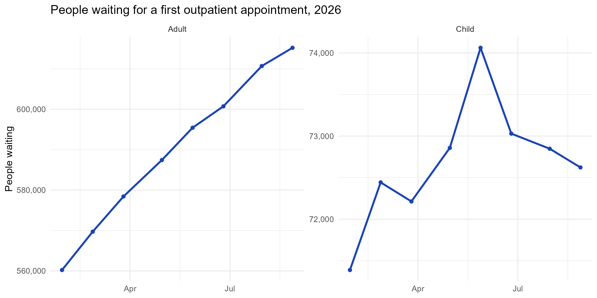
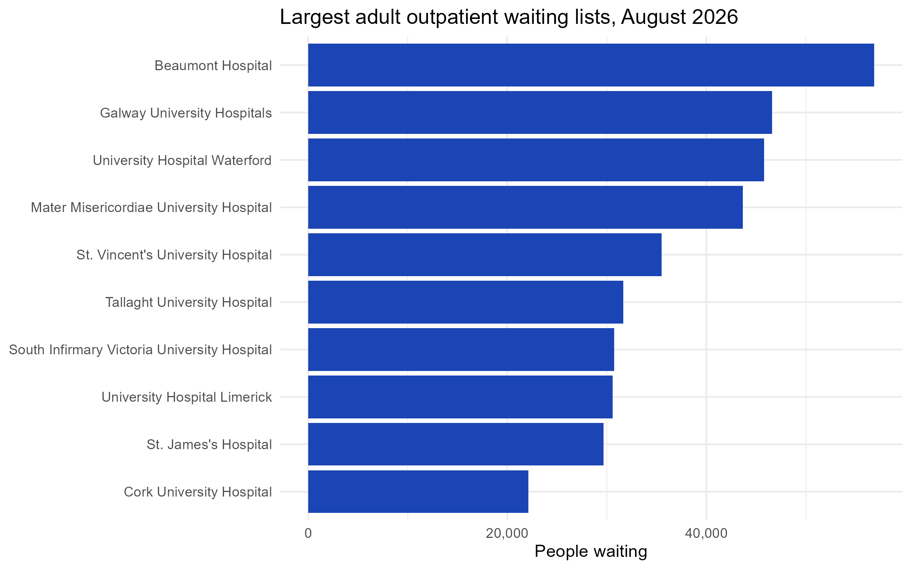
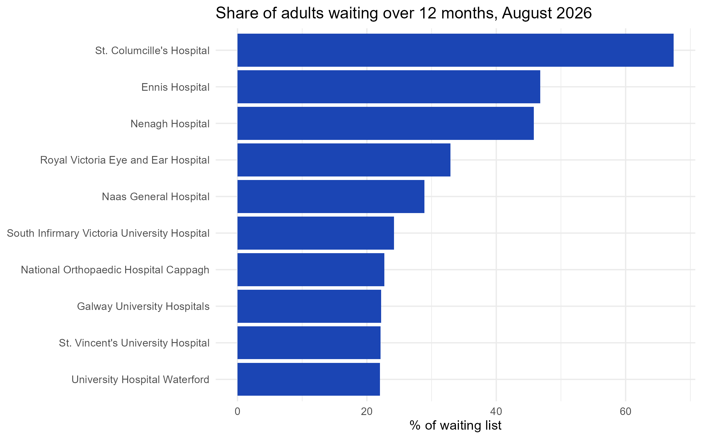

Irish Hospital Waiting List Analysis (2026)
An analysis of outpatient waiting lists across Irish public hospitals from January to August 2026, using R and SQL.
Author: Victoria Simeon, Registered Nurse and MSc Health Informatics student, University College Dublin
1. Question
How did outpatient waiting lists in Irish public hospitals change during 2026, and which hospitals are under the most pressure?
As an Emergency Department nurse, I see the effects of long waits on patients every day. This project looks at the national data behind them.
2. Data
Source: National Treatment Purchase Fund (NTPF) Outpatient Waiting List open data, available at ntpf.ie/waiting-list-data/open-data
Coverage: 8 monthly reports, January to August 2026, for 70+ public hospitals
Size: 627 records, each showing one hospital's adult or child waiting list in one month
Measures: Number of people waiting 0–6, 6–12, 12–18 and 18+ months for a first outpatient appointment
The raw data isn't included in this repository. Download the CSV from the NTPF link above and save it in a `data` folder to run the code.
Data quality checks
No missing values.
Between 77 and 79 hospital lists appear each month, so a small number of hospitals are missing from some reports.
In 207 records, the time bands differ from the total by 1–2 people. This is due to the NTPF's statistical disclosure control, which protects patient confidentiality. It's too small to affect the findings, so the published totals were used.
3. Approach
Cleaning (R): Renamed columns, converted dates, and created two new measures: the number and percentage of people waiting over 12 months.
Exploration (R): Calculated national monthly totals and compared hospitals in the latest month.
SQL: Loaded the cleaned data into a SQLite database and used SQL to find the hospitals with the largest growth, and to check the monthly figures calculated in R.
Visualisation (ggplot2): Produced charts of the national trend, the largest waiting lists and the longest waits.
4. Key findings
Adult waiting lists grew every month
The number of adults waiting rose from 560,219 in January to 615,216 in August, an increase of almost 55,000 people (+10%).

Long waits are growing twice as fast
Adults waiting over 12 months rose from 93,555 to 111,689 (+19%), nearly twice the growth rate of the list as a whole. Their share of the list increased from 16.7% to 18.2%.
Children's long waits fell
In contrast, the children's list stayed almost flat (+1.7%), and children waiting over 12 months fell by 15% (12,087 to 10,317). The data doesn't show why, but the difference between adults and children is worth further investigation.
Growth is concentrated in a few hospitals
Just 10 hospitals accounted for 71% of the national increase in adults waiting. Tallaght University Hospital added the most people (+7,489, +31%), while Cavan General (+44%) and Our Lady's Hospital, Navan (+33%) grew fastest in percentage terms.
The biggest lists aren't always the longest waits
Beaumont Hospital has the largest adult list in the country (56,838 people). But the highest share of long waits is at smaller hospitals: at St. Columcille's Hospital, 67% of adults on the list have waited over a year, followed by Ennis (47%) and Nenagh (46%).

5. Recommendations
Target resources at the hospitals driving growth. Because growth is concentrated, focusing on around 10 hospitals could address most of the national increase.
Prioritise long waiters, not just list size. The percentage waiting over a year is a better sign of pressure than the total alone.
Learn from the children's lists. Understanding what reduced long waits for children could inform action on adult lists.
6. Limitations
Covers only 8 months, so seasonal patterns can't be separated from longer-term trends.
Shows outpatient waits for a first appointment only, not inpatient, day case or follow-up care.
Shows how many people are waiting, not how many were seen or removed from the list.
The analysis describes patterns; it can't show what caused them.
7. Tools
R: `tidyverse` (cleaning, analysis and charts), `janitor`
-SQL: SQLite via `DBI` and `RSQLite`
8. How to run
Download the NTPF outpatient CSV and save it in a `data` folder.
Open the project in RStudio and run the scripts in order:
`scripts/01_load_and_clean.R`: loads, cleans and checks the data
`scripts/02_explore.R`: national trends and charts
`scripts/03_sql.R`: SQL analysis
The scripts save the charts and cleaned data to an `outputs` folder. In this repository they are shown in the main folder.
